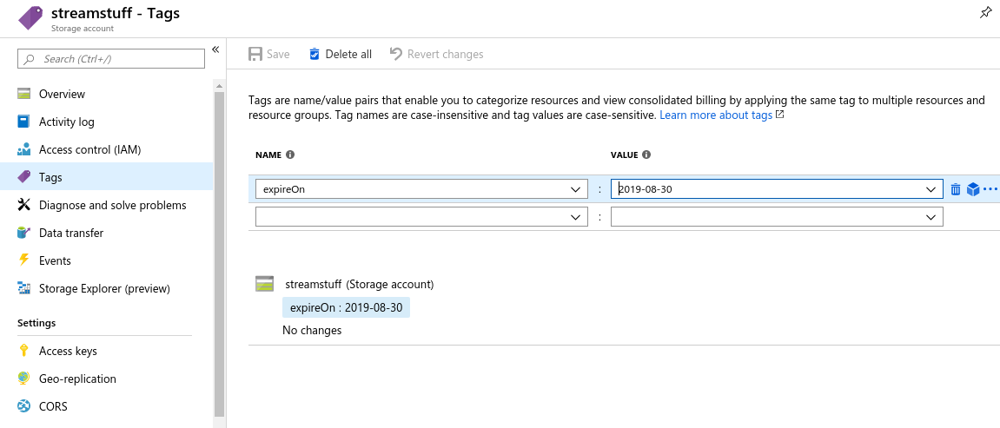

# Az Subcription Cleaner

The Simple way to keep your Azure Subscription "clean". This run on a schedule and automatically delete all "expired" resources inside your Azure Subscription, and nothing else.

A Resource is "expired" when it has a tag `expireOn` older then the current date.

# How to deploy

There is two version of this tool. One leveraging the Azure Function the second using Azure Automation. Both are valid options it just depends on your preferences.

## The Version: Azure Function

Created using the PowerShell Azure Function all details is available in the [azure-function folder](azure-function/README.md)

## The Version: Azure Automation

The Azure Automation Runbook will execute a PowerShell Script base on a pre-define schedule.

All details are available in the [azure-automation folder](azure-automation/README.md)

To deploy all the resources in your Azure subscription, just click on the **Deploy to Azure** button.

# How Does it works

By Default, the tool will get triggered every morning at 5am and search for any resources tagged with `expireOn` with a value in the past, and delete them.

Once all the "expired" resources are deleted. It will search for empty Resource Group and delete them too.

# Manage Tags

To be able to delete some resources you need to tag them with a tag `expireOn` and a date as value following the format `YYYY-MM-dd`.

## From the Azure Portal

To add a tag from the portal select any resource. Then from the left panel select the ** Tags** option and add a tag with the name `expireOn` and the desired date.

## PowerShell 

PowerShell Command to add a ExpireOn Tag

    Set-AzResource -ResourceId (Get-AzResource -ResourceGroupName todelete -Name Auto-test).ResourceId -Tag @{expireOn="2019-08-29"}

## Azure CLI

It's also possible using Azure CLI. 

    az tag list

(*instruction is coming*)

# Azure Subscription

If you don't own an Azure subscription already, you can create your **free** account today. It comes with 200$ credit, so you can experience almost everything without spending a dime.

[Create your free Azure account today](https://azure.microsoft.com/en-us/free?WT.mc_id=azsubcleaner-github-frbouche)

# Current Status, Future Features

There is a [Glo board](https://app.gitkraken.com/glo/board/XWvcyQtDJAAPG-Qo) to see what's in progress and on the road map. Feel free to great issues to request new feature or if you find bugs.

